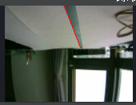

# hw4

## Setup and run the Program 

   1. Copy the code in hw4/openMV code_hw4.txt into IDE
    
   2.  Compile the program
   
   `$ cd hw4/13_7_Control_BBCar_by_Xbee/`
   
   `$ sudo mbed compile --source . --source ~/ee2405/mbed-os-build/ -m B_L4S5I_IOT01A -t GCC_ARM -f`
   
   3.  Execute the python code to control BBCar
   
   `$ cd hw4/13_6_Python_PRC`
   
   `$ sudo python3 car_control.py /dev/ttyACM0`

###   #1 XBee Controlled BB Car
  
  1. Enter whether west or east (0 represet west ; 1 represent east)
  2. Enter the value of d1(cm)
  3. Enter the value of d2(cm)
  4. Press F2 to let the bb car do reverse parking
  

###   #2 Line Following BB Car

  1. Press F1 in python as RPC command to Line Following mode 
  2. OpenMV would detected the first line that y2 is 0 as the picture below.
  
  
  
  3.  If the diiference between x1 and x2 is < 2,the car will go straight.
  4.  If x1 > x2 the car will turn left. If x1 < x2 the car will turn  right.
  5.  The bb car will stop when it had went for a fixed steps.(20 steps in demo)

###   #3 BBCar Position Calibration
   
  1. Press F3 in python as RPC command to Position Calibration mode
  

## Execution Results

###   #1 XBee Controlled BB Car
1. enter 0(east), the value of d1 d2 as picture below and press F2 to start
    
  
    demo video:
    https://drive.google.com/file/d/1_hgHBdXZDotuFUCkD5_Mi8R7mMB9JTYX/view?usp=sharing
  
2. enter 0(east) the value of d1 d2 as picture below and press F2 to start
    
  
    demo video: 
    https://drive.google.com/file/d/1fsoX5sy69TRHaDvnOt_eF2p4Fkr_gPa0/view?usp=sharing

###   #2 Line Following BB Car
1. (RPC command to Line Following mode)
    
    demo video:
    https://drive.google.com/file/d/1xM13LB_xwKywBdLqyiOhrAfjdqj0qEyG/view?usp=sharing

###   #3 BBCar Position Calibration

1. (RPC command to Position Calibration mode)
    

2. The apriltag used in this homework

    demo video:
    https://drive.google.com/file/d/196K5LSd7oFZ1Alu16aQNrnKpzlM9J6dw/view?usp=sharing

